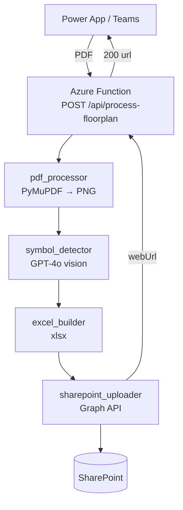

# Layout-Counter

> **Internal tool** — automatically counts furniture symbols in office floorplan PDFs using Azure OpenAI GPT-4o vision and publishes the results to SharePoint as an Excel workbook.

See [docs/architecture.md](docs/architecture.md) for the full architecture diagram.

---

## Architecture



---

## Prerequisites

| Tool | Minimum Version |
|---|---|
| [Azure CLI](https://docs.microsoft.com/cli/azure/install-azure-cli) | 2.55+ |
| [Azure Functions Core Tools v4](https://docs.microsoft.com/azure/azure-functions/functions-run-local) | 4.x |
| Python | 3.11 |
| An Azure subscription with access to **Azure OpenAI gpt-4o** in **East US** | — |

### App Registration

The SharePoint upload uses the existing app registration **`github-actions-sifcreation`**:

| Property | Value |
|---|---|
| Client ID | `569177ec-898b-46c7-8c37-70ce7fff62e6` |
| Tenant ID | `ed98cf63-c631-48b8-9937-817ea8c6cf53` |
| Required permission | `Sites.FullControl.All` (Application, admin-consented) |

You will need one of the existing client secrets for this app registration. If all secrets have expired, create a new one in the Azure Portal (Entra ID → App registrations → `github-actions-sifcreation` → Certificates & secrets).

---

## First Deployment

```bash
# 1. Set your subscription ID
export AZURE_SUBSCRIPTION_ID=<your-subscription-id>

# 2. Login to Azure CLI
az login

# 3. Deploy all infrastructure (idempotent — safe to re-run)
./infra/deploy.sh

# 4. Upload the Graph client secret to Key Vault
./infra/set-keyvault-secret.sh

# 5. Publish the function code
cd function_app
func azure functionapp publish func-layout-counter --python
```

### Windows (PowerShell)

```powershell
$env:AZURE_SUBSCRIPTION_ID = "<your-subscription-id>"
az login
.\infra\deploy.ps1
.\infra\set-keyvault-secret.sh   # or set secret via Azure Portal
cd function_app
func azure functionapp publish func-layout-counter --python
```

---

## Local Development

```bash
# Copy the settings template
cp function_app/local.settings.json.example function_app/local.settings.json

# Edit local.settings.json and fill in:
#   AZURE_OPENAI_ENDPOINT, GRAPH_CLIENT_SECRET, etc.

# Install Python dependencies
cd function_app
pip install -r requirements.txt

# Start the function locally (requires Azurite for local storage)
func start
```

Test with curl:

```bash
curl -X POST http://localhost:7071/api/process-floorplan \
     -F "pdf=@/path/to/floorplan.pdf"
```

---

## Adding Furniture Categories

1. Edit [`config/furniture_categories.yaml`](config/furniture_categories.yaml).
2. Add a new entry with `name`, optional `aliases`, and optional `description`.
3. Redeploy the function code:
   ```bash
   cd function_app && func azure functionapp publish func-layout-counter --python
   ```
   > A full infrastructure redeploy (`deploy.sh`) is only needed if you change Bicep resources.

---

## CI/CD (GitHub Actions)

The workflow at [`.github/workflows/deploy.yml`](.github/workflows/deploy.yml) is included but the trigger is commented out. To enable automatic deployment:

1. Create a **federated identity credential** on the `github-actions-sifcreation` app registration, linked to this repository's `main` branch.
2. Add these repository secrets:
   - `AZURE_SUBSCRIPTION_ID`
   - `AZURE_TENANT_ID` = `ed98cf63-c631-48b8-9937-817ea8c6cf53`
   - `AZURE_CLIENT_ID` = `569177ec-898b-46c7-8c37-70ce7fff62e6`
3. Uncomment the `push` trigger in `.github/workflows/deploy.yml`.

---

## Repository Structure

```
Layout-counter/
├── function_app/
│   ├── function_app.py              # HTTP trigger (Python v2 model)
│   ├── pdf_processor.py             # PyMuPDF: PDF → per-page PNGs at 200 DPI
│   ├── symbol_detector.py           # Async GPT-4o vision calls
│   ├── excel_builder.py             # pandas + openpyxl → .xlsx
│   ├── sharepoint_uploader.py       # Microsoft Graph upload
│   ├── logging_config.py            # Structured JSON logging + App Insights
│   ├── config_loader.py             # Loads furniture_categories.yaml
│   ├── requirements.txt
│   ├── host.json
│   └── local.settings.json.example
├── config/
│   └── furniture_categories.yaml    # Editable furniture categories
├── infra/
│   ├── deploy.sh                    # Bash deploy script
│   ├── deploy.ps1                   # PowerShell equivalent
│   ├── main.bicep                   # IaC — all Azure resources
│   ├── parameters.json              # Deploy parameters (no secrets)
│   ├── set-keyvault-secret.sh       # Upload Graph client secret to Key Vault
│   └── logs/                        # Deploy logs written here
├── .github/workflows/
│   └── deploy.yml                   # CI/CD (OIDC) — trigger commented out
├── docs/
│   └── architecture.md              # Mermaid architecture diagram
├── .gitignore
├── .funcignore
└── README.md
```

---

## Security Notes

- The Function App's system-assigned Managed Identity is granted the minimum required roles (see `infra/main.bicep`).
- The Graph client secret is stored in Key Vault and injected via a Key Vault reference — it never appears in plain text in app settings.
- `local.settings.json` is excluded from git via `.gitignore`.
- All Azure resources enforce HTTPS-only and TLS 1.2+.
